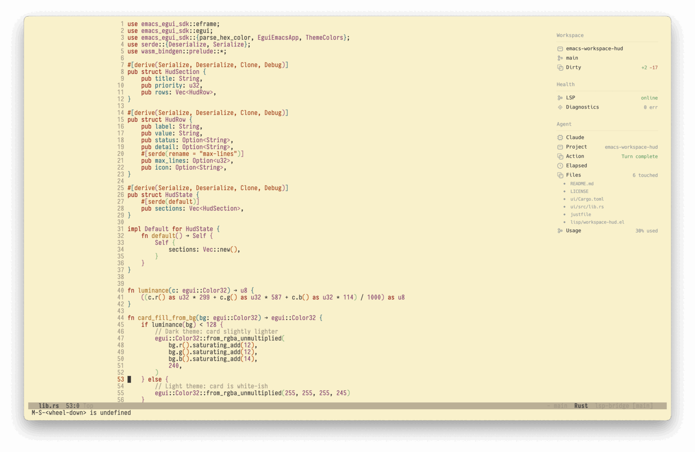

# Agent Shell HUD

[](https://github.com/nohzafk/emacs-workspace-hud)
[](https://www.gnu.org/software/emacs/)
[](https://www.gnu.org/licenses/gpl-3.0)

A real-time status bridge between **[agent-shell](https://github.com/xenodium/agent-shell)** and the **[emacs-workspace-hud](https://github.com/nohzafk/emacs-workspace-hud)** floating dashboard. See what your AI agent is doing at a glance -- even while you're working in other buffers.


*The "Agent" section shown above is provided by this package.*

## What It Shows

Once active, the package subscribes to `agent-shell` comint buffers and pushes a live **Agent** section into the Workspace HUD:

- **State** -- active agent name (e.g. `Claude Code`) and turn status (`busy`, `ok`, `warn`, `error`).
- **Current Action** -- glanceable summary of in-progress activity (e.g. `Calling fs/write_text_file` or `Wrote buffer.el`).
- **Files Touched** -- accumulated list of files modified during the active turn.
- **Context Usage** -- token consumption percentage (e.g. `42% used`) extracted on turn completion.

## Requirements

- **Emacs 29.1+** with **xwidget support** (`(featurep 'xwidget-internal)`)
- **[emacs-workspace-hud](https://github.com/nohzafk/emacs-workspace-hud)** -- the floating HUD framework (must be installed and working first)
- **[agent-shell](https://github.com/xenodium/agent-shell)** (`>= 0.50.1`)

## Installation

### 1. Install emacs-workspace-hud (prerequisite)

`emacs-workspace-hud` requires a local WASM build. Follow **one** of the two options below.

#### Option A -- `use-package` with `:vc` (Emacs 30+)

```elisp
(setq package-vc-allow-build-commands '(emacs-workspace-hud))

(use-package emacs-workspace-hud
  :vc (:url "https://github.com/nohzafk/emacs-workspace-hud"
       :rev :newest
       :lisp-dir "lisp"
       :shell-command
       "git submodule update --init --recursive && cd ui && wasm-pack build --target web --release")
  :bind ("C-c d h" . workspace-hud-toggle)
  :init
  (workspace-hud-auto-mode 1))
```

#### Option B -- Manual clone (Emacs 29.1+)

```sh
# Clone with submodules (includes the emacs-egui framework)
git clone --recurse-submodules https://github.com/nohzafk/emacs-workspace-hud.git \
  ~/src/emacs-workspace-hud

cd ~/src/emacs-workspace-hud

# One-time toolchain setup: installs wasm32-unknown-unknown target + wasm-pack
just setup

# Build the WebAssembly UI
just wasm
```

Then in your Emacs config:

```elisp
(add-to-list 'load-path "~/src/emacs-workspace-hud/lisp")
(require 'workspace-hud)
(workspace-hud-auto-mode 1)
```

> **Build prerequisites**: Rust toolchain (2021 edition), [`wasm-pack`](https://rustwasm.github.io/wasm-pack/), and optionally [`just`](https://github.com/casey/just). Without `just`, run: `cd ui && wasm-pack build --target web --release`.

### 2. Install agent-shell-hud

#### With `use-package` + `:vc` (Emacs 30+)

```elisp
(use-package agent-shell-hud
  :vc (:url "https://github.com/nohzafk/agent-shell-hud"
       :rev :newest)
  :after (workspace-hud agent-shell)
  :init
  (agent-shell-hud-mode 1))
```

#### Manual clone

```sh
git clone https://github.com/nohzafk/agent-shell-hud.git ~/src/agent-shell-hud
```

```elisp
(add-to-list 'load-path "~/src/agent-shell-hud")
(require 'agent-shell-hud)
(agent-shell-hud-mode 1)
```

## Usage

Enable the global minor mode -- it activates automatically whenever an `agent-shell` buffer starts an agent session:

```elisp
(agent-shell-hud-mode 1)
```

No further configuration is needed. The Agent section appears in the HUD when an agent is active and is removed when the session ends.

## Development

```sh
just compile  # Byte-compile the Elisp source (checks for warnings)
just clean    # Remove byte-compilation artifacts
```
